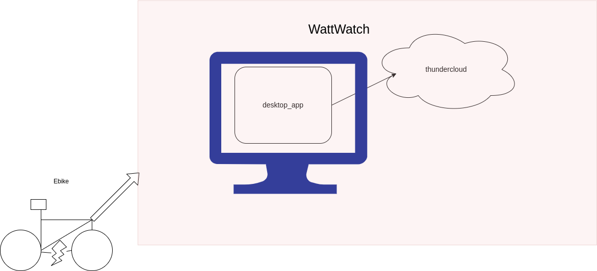

# WattWatch

WattWatch is a ebike telemetry tool to capture, analyze and visualize ebike statistics. The complete tool includes two sub applications


### desktop_app
desktop_app is written in python using PySide6. The desktop application is responsible for capturing data from the ebike and normalizing the data to send to the backend server called thundercloud. 

#### Data simulation
For the time being ride data is being simulated by providing csv files of ride data in the format timestamp, long, lat, speed, batery state of charge.
This data is assumed to be captured from the ebike and managed as such.


### thundercloud
thundercloud is a backend server written using FastAPI to deliver a CRUD interface for storage and analysis. Currently the data storage is run time only. 

## Getting Started
### Dependencies
WattWatch utilizes python3.12 and uv for package management. Make sure that uv is installed:

https://github.com/astral-sh/uv


### Starting desktop_app
To start the desktop_app, navigate to the deskotp_app directory then run the main.py via uv:

```
$ cd desktop_app
$ uv run desktop_app/main.py`
```

This will install the correct version of python and all dependencies needed and start the desktop application

### Starting thundercloud cloud service
To start the thundercloud service, navigate to the thundecloud folder and then start the thundercloud server via uv:
```
$ cd thundercloud
$ uv run uvicorn main:app --reload
```

### Tests
Unit tests are in the `test folder`. To execute the tests have to be executed from the top level of each application. Currently there are only tests for the desktop_app.

For example to run the tests against the `desktop_app`:
```
$ cd desktop_app
$ python -m pytest .
```